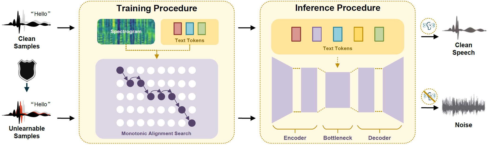

# Pivatoal Objective Perturbation

The is the source code of the paper "Mitigating Unauthorized Speech Synthesis for Voice Protection" in CCS-LAMPS 2024. We propose a voice protection technique against training procedure via pivotal objective perturbation (POP) which can disrupt the speech synthesis after effective finetuning on advanced models.





## Setup

We tested our experiments on Ubuntu 20.04.

The required dependencies can be installed by running the following:

```bash
conda create --name pop python=3.9
conda activate pop
pip install -r vits/requirements.txt
sudo apt install ffmpeg

cd vits/monotonic_align
python setup.py build_ext --inplace
```

You can download the pre-trained checkpoint on LJSpeech dataset from [here](https://drive.google.com/drive/folders/1ksarh-cJf3F5eKJjLVWY0X1j1qsQqiS2) and move it to "checkpoints/pretrained_ljs.pth".


## 1. Dataset

In our paper, we conduct our experiments on two multi-speaker dataset ([LibriTTS](https://www.openslr.org/resources/60/train-clean-100.tar.gz) and [CMU ARCTIC](http://festvox.org/cmu_arctic/packed/)) and one speaker dataset (detailed in paper's Section 5.6). We follow [VITS](https://github.com/jaywalnut310/vits) to process the dataset.

We should build file list at first. Each row of the dataset file list represents an audio data, and its format should be represented as follows:

```bash
audio_path|speaker_id|text
```

And the structure of `audio_path` should be `data/{speaker}`, where `{speaker}` represents the speaker name or ID. Subsequently, you can use the following command to process (g2p) your own dataset.

```bash
python text_preprocess.py --text_index 2 --filelists <your file list>
```


## 2. Protect

 After successfully building the model and dataset, you can use the following command to protect the dataset:

```bash
python protect.py --config_path <your config path> --protected_mode POP
```

Here are some basic arguments that you can set:

- `--device`: The training device which should be GPU or CPU. Default: "cuda".
- `--model_name`: The selected model. Default: "VITS". (You can choose other models such as MB-iSTFT-VITS and GlowTTS).
- `--dataset_name`: The selected dataset pending protection. Default: "OneSpeaker". (You can choose other datasets such as LibriTTS and CMU ARCTIC).
- `--config_path`: The configuration path for building model. Default: "configs/onespeaker_vits.json".
- `--pretrained_path`: The checkpoint path of the pre-trained model. Default: "checkpoints/pretrained_ljs.pth".
- `--epsilon`: The protective radius of the embedded perturbation by $\ell_p$ norm. Default: 8/255.
- `--iterations`: Running iterations. Default: 200.
- `--mode`: The corresponding four protection modes in this paper. Default: "POP".

We have provided four protective mode ["POP", "EM", "RSP", "ESP"]. In this context, POP and EM involve perturbing the patche at fixed positions within an audio file, while RSP and ESP involve perturbing the entire audio segment. Therefore, if you wish to use our method for comparison and apply perturbations across the entire audio segment, you can utilize the ESP mode.

Running this script will generate perturbations for each audio sample, saving them in batches to the directory `checkpoints/noises/`.


## 3. Training

1. Train on clean samples and test the model's speech cloning capability.

```bash
python train.py --config_path <your config path> --dataset_name LibriTTS --is_fixed True
```

The argument `is_fixed` represents whether training of the audio patches at the fixed positions. We have discussed it in paper's Section 5.5.

2. Train on protected samples and test the anti-cloing capability.

```bash
python protected_train.py --config_path <your config path> --dataset_name LibriTTS --noise_path <noise path> 
```

The batch size of training on the protected dataset must be the same as the perturbation generation's.


## 4. Evaluation

After each training session, we assess the model's speech cloning performance using two objective evaluation metrics: Mel Cepstral Distortion (MCD) and Word Error Rate (WER). Our evaluation script is named `evaluate.py`.

After generating the protective perturbation files, you can use the following command to save the audio with the protection applied.

```bash
python save_audio.py --config_path <your config path> --noise_path <noise> --store_path <your saving folder>
```


## Citation

If you find our repository helpful, please consider citing our work in your research or project.

```
@inproceedings{zhang2024mitigating,
  title={Mitigating Unauthorized Speech Synthesis for Voice Protection},
  author={Zhang, Zhisheng and Yang, Qianyi and Wang, Derui and Huang, Pengyang and Cao, Yuxin and Ye, Kai and Hao, Jie},
  booktitle={the 1st ACM Workshop on Large AI Systems and Models with Privacy and Safety Analysis (LAMPS'24)},
  year={2024},
  organization={ACM},
  address={Salt Lake City, UT, USA},
  month={October}
}
```


#### 